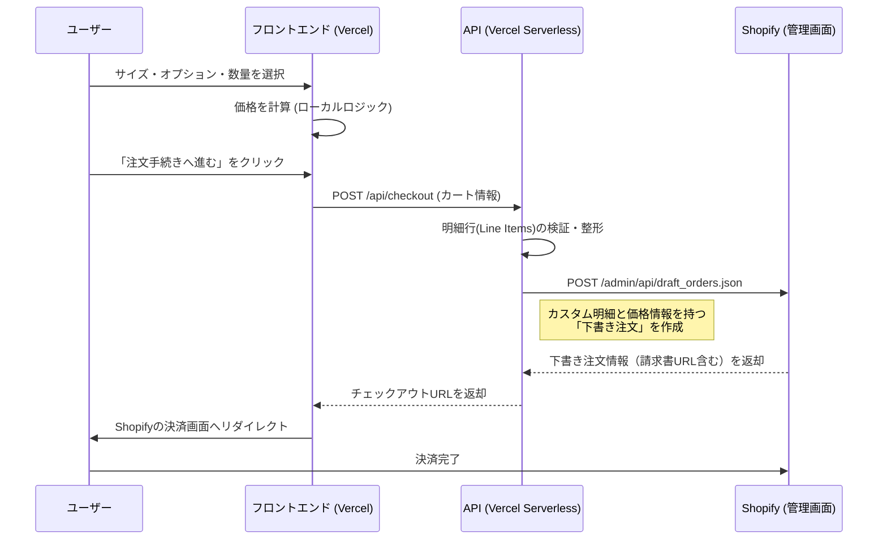

# Shopify 連携アーキテクチャ

本ドキュメントでは、**Nobori App** がどのようにShopifyと連携し、カスタム製品の見積もりと注文処理を行っているかを解説します。

## 概要

本アプリケーションは **ヘッドレスアーキテクチャ** を採用しており、フロントエンド（Vercel）がUIと価格計算を担当し、Shopifyは純粋にバックエンドとして以下の機能のみを担当します。

- 注文管理（チェックアウト）
- 決済処理
- 顧客管理

「のぼり旗」はサイズやオプションの組み合わせが無限にあるため、Shopify上にすべてのバリエーションを商品として事前登録することは**行いません**。代わりに、**下書き注文 (Draft Order) API** を使用して、注文のたびに動的に商品を生成します。

## アーキテクチャ図

## 詳細な実装フロー

### 1. ストア接続 (Storefront API)
- **ファイル**: `src/lib/shopify.ts`
- **目的**: ストアの基本情報（名前、説明）を取得し、接続確認を行います。
- **認証**: **Public Access Token** を使用（または公開データの場合はトークンレス）。
- **用途**: 主にヘルスチェックや、必要に応じて静的コンテンツを取得するために使用します。

### 2. チェックアウト処理 (Admin API)
- **ファイル**: `api/checkout.ts`
- **目的**: Shopify上に実際の注文データを作成します。
- **認証**: **Admin API Access Token** (機密情報) を使用します。
- **仕組み**:
    1. フロントエンドからカートデータを受け取ります。
    2. 各アイテムを（既存の商品IDではなく）カスタム明細行としてマッピングします。
    3. フロントエンドで計算された価格を明示的にセットします。
    4. メタデータ（生地、サイズ、オプション）を `properties` として付与します。
    5. ユーザーをShopifyの決済画面に誘導するための `invoice_url` を返します。

## セットアップ要件

本システムを動作させるには、Vercel側で以下の環境変数が必要です。

| 変数名 | 説明 | 設定例 |
|---|---|---|
| `SHOPIFY_SHOP_DOMAIN` | 対象の myshopify.com ドメイン | `example.myshopify.com` |
| `SHOPIFY_ACCESS_TOKEN` | Admin API トークン (`shpat_` で始まるもの) | `shpat_xxxxxxxx` |

### Adminトークンに必要な権限 (Scope)
カスタムアプリの設定にて、Adminトークンには以下のスコープが必要です。
- `write_draft_orders`
- `read_draft_orders`

## トラブルシューティング

### "Shopify credentials not configured" エラー
- **原因**: Vercelの環境変数が設定されていません。
- **対応**: Vercelの `Settings` > `Environment Variables` を確認してください。

### チェックアウトへのリダイレクト失敗 (403/Forbidden)
- **原因**: APIトークンに `write_draft_orders` 権限が付与されていない可能性があります。
- **対応**: Shopify管理画面 > 設定 > アプリと販売チャネル > (対象アプリ) > API認証情報 > Admin APIのスコープを構成 から権限を追加してください。

### Shopify上での価格不整合
- **注意**: 本システムは価格を**明示的に**指定してShopifyに送信するため、Shopify側での再計算は行われません。`src/utils/priceCalculator.ts` の計算ロジックが正しいことを常に確認してください。
